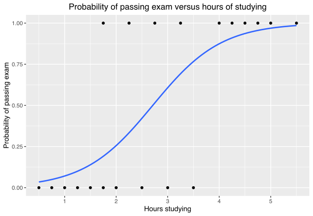

# Logistic Regression

Logistic regression is used for binary classification problems---predicting outcomes that have two possible values. It is hence particularly useful for binary classification tasks.

Logistic regression is a powerful tool for classification problems, especially in fields like medical data science and social sciences.

The extension for discrete (categorical) outcomes (i.e. more than two) is called multinomial logistic regression.

## Logistic Regression Model

In logistic regression, the probability of the target variable being true is modeled as a function of the independent variables. The logistic function transforms linear regression output into probabilities:

$$ \log\left(\frac{p}{1 - p}\right) = \beta_0 + \beta_1x_1 + \beta_2x_2 + ... + \beta_nx_n $$

where $p$ is the probability of the dependent variable equaling a case (often denoted as 1). Note that $p$ itself is a value between 0 and 1.

Logistic regression hence models the log-odds $\frac{p}{1 - p}$ of the probability $p$ of an event occurring.

### Univariate Logistic Regression

Involves a single independent variable $x$. Univariate logistic regression models the relationship between a predictor variable and the probability of a particular outcome. The model is expressed as:

$$ \log\left(\frac{p}{1 - p}\right) = \beta_0 + \beta_1x $$

-   $p$ is the probability of the event (e.g., having a disease).
-   $\beta_0$ is the intercept.
-   $\beta_1$ is the coefficient for the predictor variable.
-   $x$ is the predictor variable (e.g., blood pressure).

### Multivariate Logistic Regression

Involves not olny one predictor $x$, but multiple independent variables $x_1, x_2, …$

## Meaning of Coefficients

Each coefficient in the model represents the change in the log-odds of the dependent variable per unit change in the predictor. For a positive coefficient, as the predictor increases, the log-odds of the outcome occurring increase, and thus the probability of the outcome occurring also increases.

::: {style="color: gray;"}
**Example: Impact of Coefficients in Logistic Regression by Doubling of Odds**

To illustrate how a coefficient in logistic regression influences the prediction, let's consider an example. Assume we have a univariate logistic regression model where the outcome variable is whether a patient has a certain disease (yes or no), and we have one predictor variable, say, blood pressure.

Consider again therefore: $$ \log\left(\frac{p}{1 - p}\right) = \beta_0 + \beta_1x $$

If $\beta_1 = \log(2)$ or approximately 0.693, this indicates that for each one-unit increase in $x$, the odds of the event occurring are doubled. This is derived from:

$$ \log\left(\frac{p}{1 - p}\right) = \beta_0 + \log(2) \cdot x $$

In order to calculate the odds, the exponential function is used on both sides of the equation. When $x$ increases by 1, the log-odds increase by $\log(2)$, and the odds are thus multiplied by $e^{\log(2)} = 2$. Thus, the probability of the event occurring becomes twice as high for each unit increase in the predictor variable.
:::

## ROC and AUC in Logistic Regression

The Receiver Operating Characteristic (ROC) curve is a graphical representation of a classification model's diagnostic ability. ROC curve plots the True Positive Rate (Sensitivity) against the False Positive Rate (1 - Specificity) for different threshold values.

More specifically, in logistic regression, ROC curve is created by plotting the True Positive Rate (TPR) against the False Positive Rate (FPR) at various threshold settings. The TPR is the proportion of positive cases correctly identified, while the FPR is the proportion of negative cases incorrectly identified as positive.

To calculate the ROC curve, you typically:

1.  Predict the probability $p$ of the positive class using the logistic regression model for each instance in the dataset.

2.  Vary the decision threshold from 0 to 1, i.e. check whether $p$ is larger said threshold.

3.  At each threshold, calculate the TPR and FPR, i.e. check how many cases are correctly identified as such and which are misclassified.

4.  Plot these values, creating a curve that shows the trade-off between TPR and FPR at different thresholds.

Area Under the Curve (AUC) provides a single measure of a model's performance, quantifying the overall ability of the test to discriminate between positive and negative cases. The AUC can theoretically be 0, but a random classifier would achieve a AUC of 0.5 The maximum (and hence ideal) AUC is 1.

## Bootstrapping

Bootstrapping is a resampling technique used to estimate the distribution of a statistic (like the mean or median) by repeatedly sampling with replacement from the data set. In logistic regression, it's often used for internal validation, to assess the stability and reliability of the model.

### Resampling in Bootstrapping

Resampling in bootstrapping involves repeatedly drawing samples (with replacement, i.e. the same data-point can be selected several times) from the original dataset and calculating the statistic of interest for each sample. This process creates a distribution of the statistic, allowing for estimation of its variance and confidence intervals.

::: {style="color: gray;"}
**Example: Bootstrapping**

Imagine a dataset with 100 observations. In bootstrapping, you might randomly select 100 observations from this dataset, with replacement (i.e. there are duplicates), to form a new sample. This process is repeated many times (e.g., 1000 times) to create many bootstrap samples.
:::

### Use in Internal Validation

Bootstrapping is useful for internal validation of models, such as logistic regression models, in several ways:

-   Stability Testing: It helps in assessing the stability of the model by examining how much the predictions vary across different bootstrap samples.

-   Error Estimation: Bootstrapping can be used to estimate the error (like standard error) of model coefficients or predictions.

-   Overfitting Assessment: It helps in assessing whether a model is overfitting the training data by evaluating its performance across multiple resampled datasets.

This method is particularly valuable when the original dataset is not large enough to split into separate training and validation sets, as it allows for effective internal validation using the available data.

An alternative method would be cross-validation, where the data is repeatedly split up into training and test batches.

## Nagelkerke's R²

This is a pseudo R-squared measure for logistic regression.

Nagelkerke's R² is a modified version of the R-squared statistic adapted for logistic regression. It provides an estimation of the variance explained by the model.

$$ R_{\text{Nagelkerke}}^2 = \frac{1 - e^{-2/n(L_{\text{model}} - L_0)}}{1 - e^{-2/n(L_{\text{max}} - L_0)}} $$

where $L_{\text{model}}$ is the log-likelihood of the model, $L_0$ is the log-likelihood of the null model, $L_{\text{max}}$ is the log-likelihood of the perfect model, and $n$ is the sample size.

Nagelkerke's R² is an adaptation of the Cox & Snell R² that adjusts the scale so the maximum value is 1.

## External Validation Using Hold-Out Data

External validation involves assessing the model's predictive performance on a separate dataset that was not used during the model building process. This process helps to evaluate how well the model generalizes to new, unseen data, which is crucial for assessing the practical utility of the model.
